# 广东财经大学图书馆管理系统

# 运行须知

本项目是大学时期的课程设计，执行resourse下面的sql的文件，以及修改application.propeties下的mysql路径，启动项目，访问localhost:8080，账户1，密码1，该账户为管理员账户并且具有权限功能，不同权限的用户其能访问的页面和功能不同，管理员账户具有所有的权限。

# 系统介绍

登录页面：

登录后的第一页：

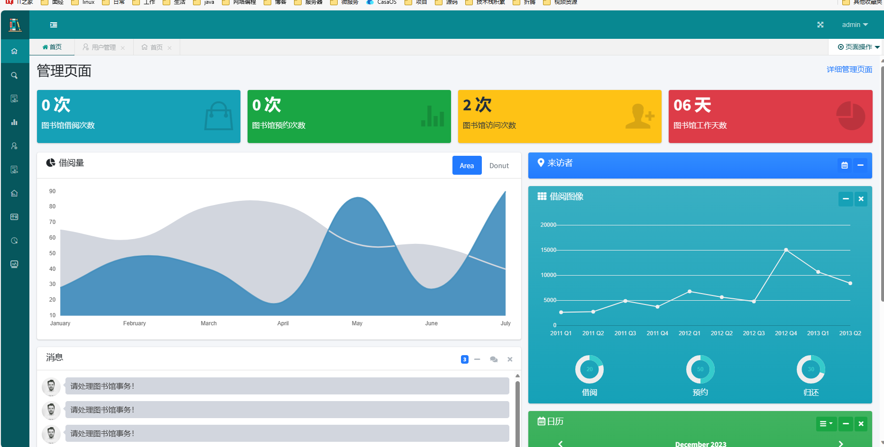

个人首页：

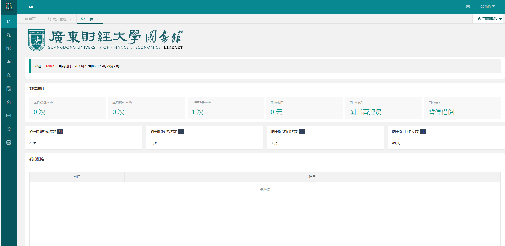

侧边栏：

图书检索页面：

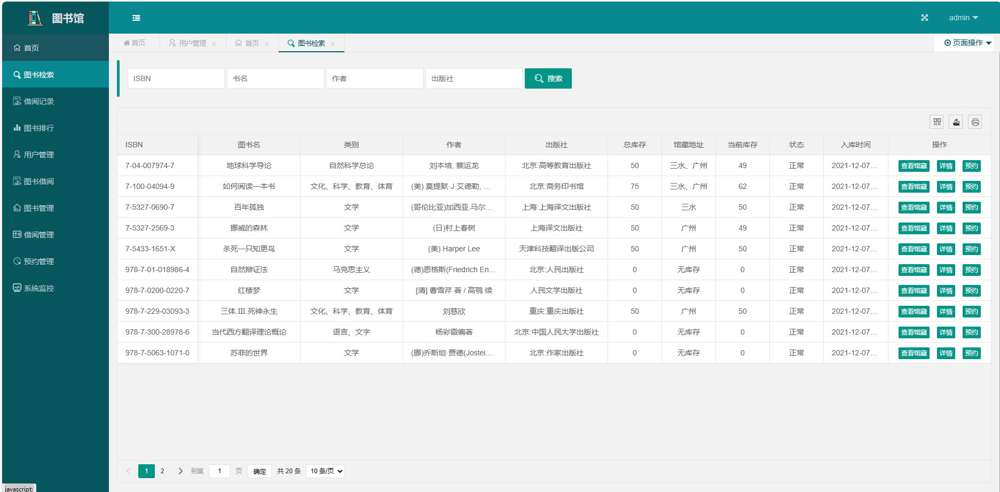

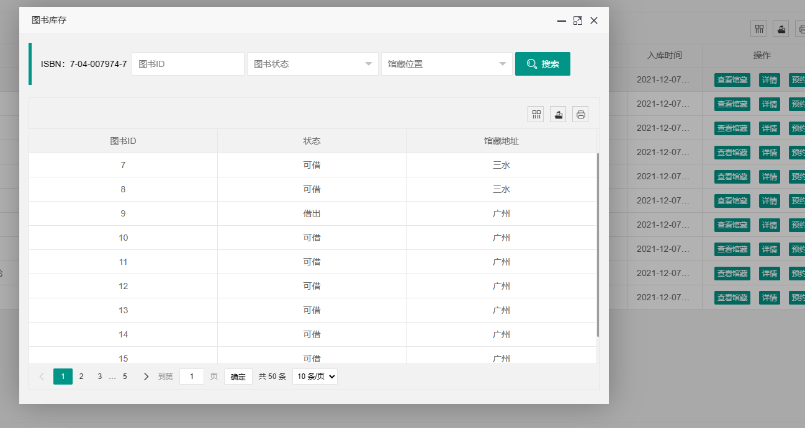

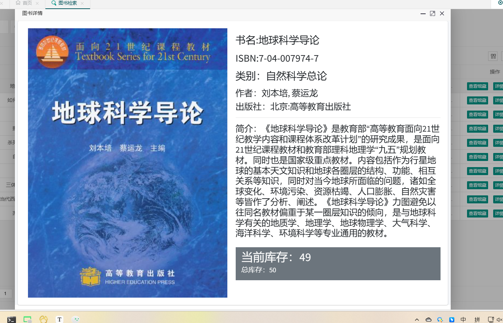

借阅记录：

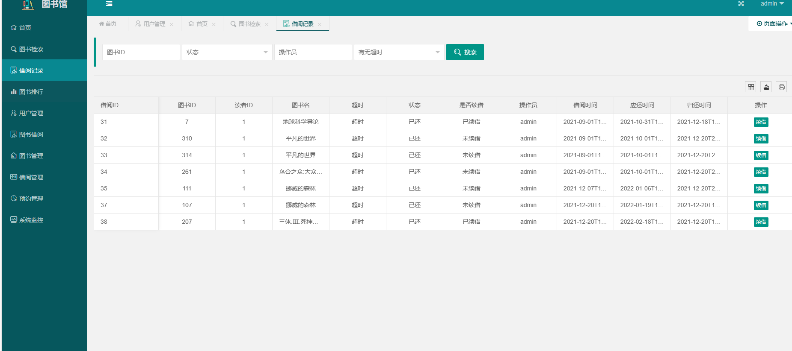

图书排行：

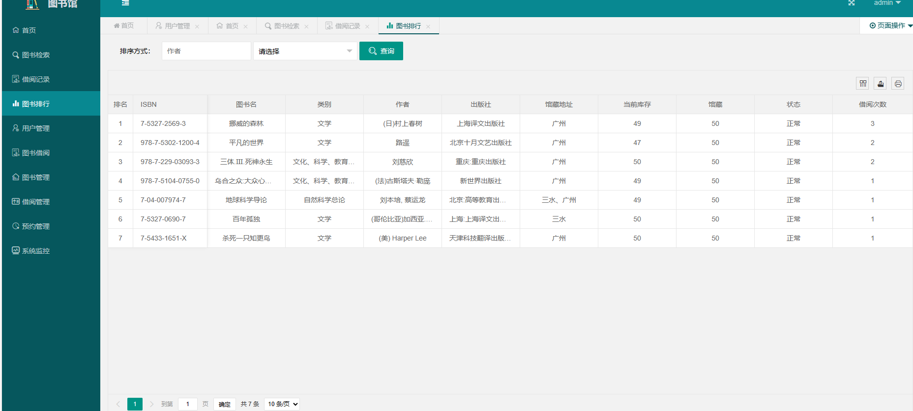

用户管理：

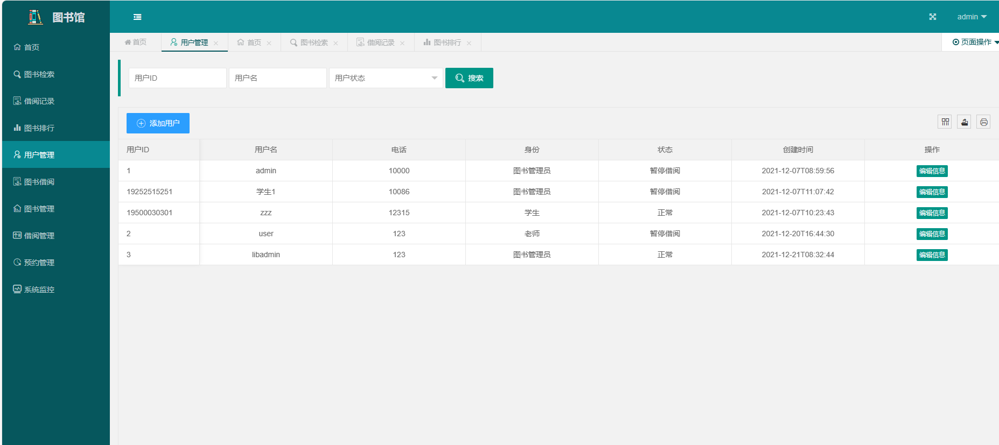

图书借阅：

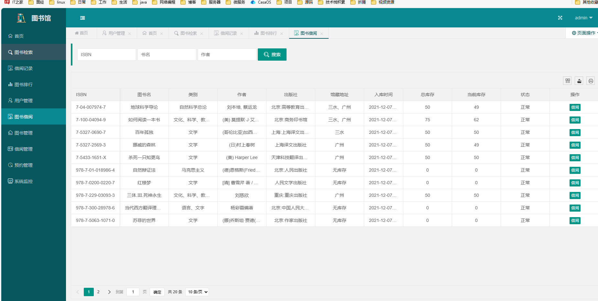

图书管理：

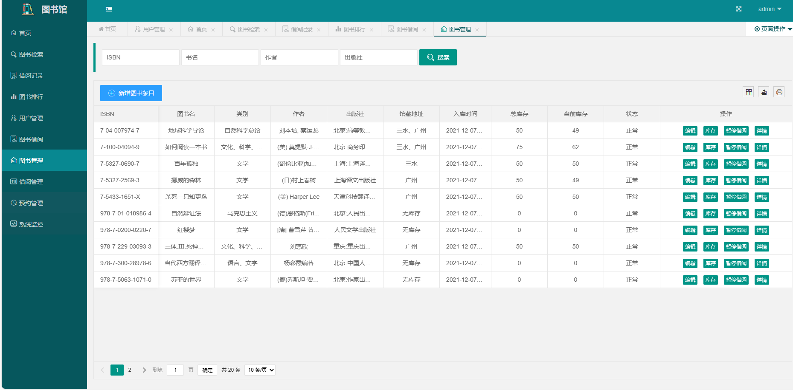

借阅管理：

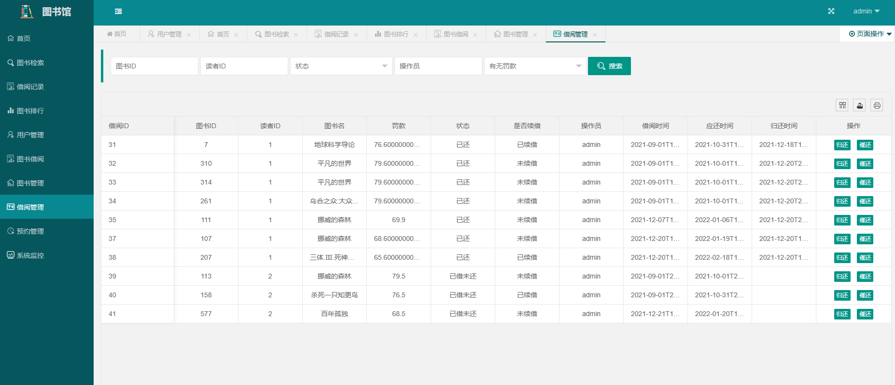

预约管理：

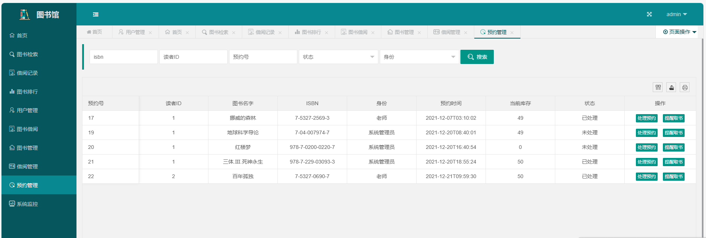